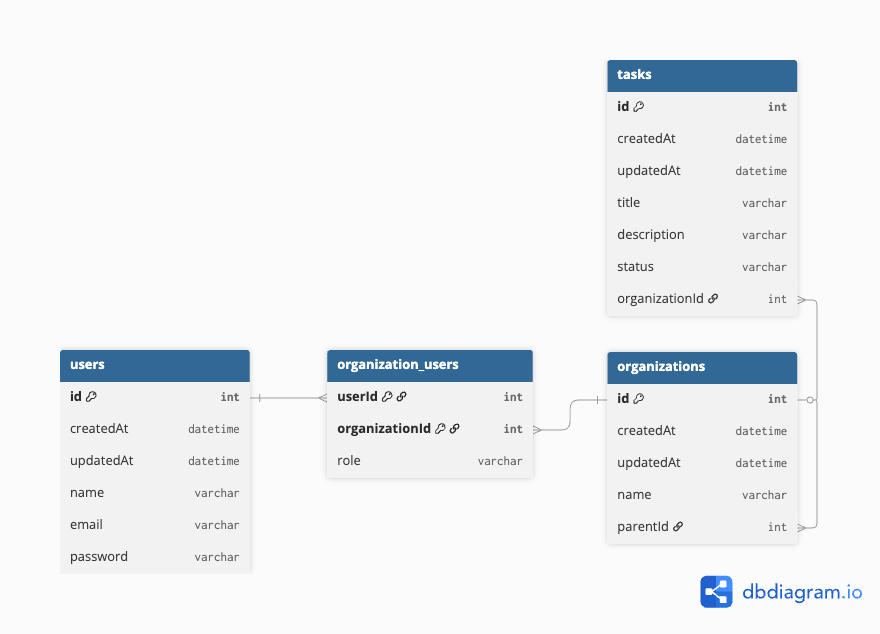

# TaskManagement

## Setup Instructions
- Node.js >= 18.x
- NPM
- Nx CLI installed globally (optional)

```
# installing nx cli
npm install -g nx
```

## Clone repository
```
# using web url
git clone https://github.com/raviassis/task-management.git

# using ssh
git clone git@github.com:raviassis/task-management.git
```

## Install Dependencies
```
cd task-management
npm install
```

## Environment Variables
### API
```
# development
./apps/api/.env.development
# production
./apps/api/.env.production
# for local-only
cp ./apps/api/.env-example ./apps/api/.env

```
### DASHBOARD
```
# dev
./apps/dashboard/src/environments/environment.ts
# prd
./apps/dashboard/src/environments/environment.ts
```

## Database
WIP: Until the moment, the api is only using SQLite.
TODO: Setup Postgres
TODO: Setup migrations

## Running project
### Development
```
# api
nx run api:serve
# dashboard
nx run dashboard:serve
```

### Production
```
# api
nx run api:build:production
node dist/apps/api/main.js

# dashboard
nx run dashboard:build:production
# serve dist/apps/dashboard/browser using nginx or node server

## exemple using npx serve
## Don't do it in production
npx serve dist/apps/dashboard/browser -s
```

# Architecture Overview

## Project sctructure
```
task-management/
├─ apps/
│  ├── api/           # NestJS backend application
│  └── dashboard/     # Angular frontend application
└─ libs/
   ├── data/          # Shared TypeScript interfaces & DTOs
   └── rbac/          # Reusable RBAC logic
```

## ERD Diagram


## Access Control Implementation
This project enforces access control using role-based permissions 
into organizational context. 

### 🛂 Role-Based Permissions Table

| Permission                     | Owner  | Admin | Viewer    |
|--------------------------------|--------|-------|-----------|
| `task:view`                    | ✅     | ✅    | ✅         |
| `task:create`                  | ✅     | ✅    | ❌         |
| `task:edit`                    | ✅     | ✅    | ❌         |
| `task:delete`                  | ✅     | ✅    | ❌         |
| `organization:view`            | ✅     | ✅    | ✅         |
| `organization:edit`            | ✅     | ❌    | ❌         |
| `organization:delete`          | ✅     | ❌    | ❌         |
| `sub_organization:create`      | ✅     | ❌    | ❌         |
| `organization:invite`          | ✅     | ❌    | ❌         |

### How permissions are checked
When a resource or action is requested the system verify the user 
permissions based on their role in the organization.

Basically, given the resource references (organization id) and user identification (user id), the system check the table organization_users
for and retrieve the user role.

With the user role, the system check the `RolePermissionsMap` and compere with the required permission for that resource.

The package `libs/rbac` offer the available roles (`RoleEnum`), permissions (`PermissionsEnum`) and a function to verify the role permission (`hasPermission(role: RoleEnum, permission: PermissionsEnum): boolean`)

## Api documentation
### [Public] POST /api/auth/login
#### Body
```
{
  "email": "test1@test.com",
  "password": "$trongPassword123"
}

```
#### Response
```
# HTTP 200
{
    "sub": 1,
    "id": 1,
    "email": "test1@test.com",
    "name": "Tester 1",
    "access_token": "jwt-token"
}
```
#### Example
```
curl --location 'http://localhost:3000/api/auth/login' \
--header 'Content-Type: application/json' \
--data-raw '{
  "email": "test1@test.com",
  "password": "$trongPassword123"
}'
```
### [Public] POST /api/auth/register
#### Body
```
{
  "email": "test2@test.com",
  "name": "Tester 2",
  "password": "$trongPassword123"
}
```
#### Response
```
# HTTP 201
{
  "id": 2,
  "email": "test2@test.com",
  "name": "Tester 2",
  "createdAt": "2025-08-09T14:21:05.000Z",
  "updatedAt": "2025-08-09T14:21:05.000Z"
}
```
### [Protected] GET /api/users
#### Response
```
# HTTP 200
[
  {
    "id": 1,
    "email": "test1@test.com",
    "name": "Tester 1"
  },
  {
    "id": 2,
    "email": "test2@test.com",
    "name": "Tester 2"
  }
]
```
#### Example
```
curl --location 'http://localhost:3000/api/users' \
--header 'Authorization: Bearer <access_token>'
```
### [Protected] POST /api/organizations
#### Body
```
{
  "name": "Sub Org 1",
  "parentId": 1
}
```
#### Response
```
{
    "name": "Sub Org 1",
    "members": [
        {
            "userId": 1,
            "role": "owner",
            "organizationId": 2
        }
    ],
    "subOrganizations": [],
    "parent": {
        "id": 1,
        "createdAt": "2025-08-09T14:22:44.000Z",
        "updatedAt": "2025-08-09T14:22:44.000Z",
        "name": "Org 1",
        "parent": null,
        "members": [
            {
                "userId": 1,
                "organizationId": 1,
                "role": "owner",
                "user": {
                    "id": 1,
                    "createdAt": "2025-08-09T14:20:59.000Z",
                    "updatedAt": "2025-08-09T14:20:59.000Z",
                    "name": "Tester 1",
                    "email": "test1@test.com"
                }
            }
        ],
        "subOrganizations": []
    },
    "id": 2,
    "createdAt": "2025-08-09T14:23:10.000Z",
    "updatedAt": "2025-08-09T14:23:10.000Z"
}
```
#### Exemple
```
curl --location 'http://localhost:3000/api/organizations' \
--header 'Content-Type: application/json' \
--header 'Authorization: Bearer <access_token>' \
--data '{
  "name": "Sub Org 1",
  "parentId": 1
}'
```
### [Protected] PUT /api/organizations/:id
#### Body
```
{
  "name": "test organization 1"
}
```
#### Response
```
{
  "name": "Sub Org 1",
  "members": [
    {
      "userId": 1,
      "role": "owner",
      "organizationId": 2
    }
  ],
  "subOrganizations": [],
  "parent": {
    "id": 1,
    "createdAt": "2025-08-09T14:22:44.000Z",
    "updatedAt": "2025-08-09T14:22:44.000Z",
    "name": "Org 1",
    "parent": null,
    "members": [
      {
        "userId": 1,
        "organizationId": 1,
        "role": "owner",
        "user": {
          "id": 1,
          "createdAt": "2025-08-09T14:20:59.000Z",
          "updatedAt": "2025-08-09T14:20:59.000Z",
          "name": "Tester 1",
          "email": "test1@test.com"
        }
      }
    ],
    "subOrganizations": []
  },
  "id": 2,
  "createdAt": "2025-08-09T14:23:10.000Z",
  "updatedAt": "2025-08-09T14:23:10.000Z"
}
```
#### Exemple
```
curl --location --request PUT 'http://localhost:3000/api/organizations/5' \
--header 'Content-Type: application/json' \
--header 'Authorization: Bearer <access_token>' \
--data '{
  "name": "test organization 1"
}'
```
### [Protected] GET /api/organizations/:id
#### Response
```
{
  "id": 1,
  "createdAt": "2025-08-10T20:06:49.000Z",
  "updatedAt": "2025-08-10T20:07:17.000Z",
  "name": "Org 1",
  "parent": null,
  "members": [
    {
      "userId": 1,
      "organizationId": 1,
      "role": "owner",
      "user": {
        "id": 1,
        "createdAt": "2025-08-10T20:05:02.000Z",
        "updatedAt": "2025-08-10T20:05:02.000Z",
        "name": "Tester 1",
        "email": "test1@test.com"
      }
    },
    {
      "userId": 3,
      "organizationId": 1,
      "role": "viewer",
      "user": {
        "id": 3,
        "createdAt": "2025-08-10T20:06:31.000Z",
        "updatedAt": "2025-08-10T20:06:31.000Z",
        "name": "Tester 2",
        "email": "test2@test.com"
      }
    }
  ],
  "subOrganizations": [
    {
      "id": 2,
      "createdAt": "2025-08-10T20:07:01.000Z",
      "updatedAt": "2025-08-10T20:07:01.000Z",
      "name": "SubOrg 1"
    }
  ]
}
```
#### Example
```
curl --location 'http://localhost:3000/api/organizations/1' \
--header 'Authorization: Bearer <access_token>'
```
### [Protected] DELETE /api/organizations/:id
#### Response
```
HTTP 204 No Content
```
### Example
```
curl --location --request DELETE 'http://localhost:3000/api/organizations/5' \
--header 'Authorization: Bearer <access_token>'
```
### [Protected] PUT /api/organizations/:orgId/members/:userId
#### Body
```
{
  "role": "viewer"
}
```
#### Response
```
HTTP 200 OK
```
### Example
```
curl --location --request PUT 'http://localhost:3000/api/organizations/1/members/2' \
--header 'Content-Type: application/json' \
--header 'Authorization: Bearer <access_token>' \
--data '{
  "role": "viewer"
}'
```
### [Protected] DELETE /api/organizations/:orgId/members/:userId
#### Response
```
HTTP 204 No Content
```
#### Example
```
curl --location --request DELETE 'http://localhost:3000/api/organizations/3/members/3' \
--header 'Authorization: Bearer <access_token>'

```
###[Protected] POST /api/organizations/:orgId/tasks
#### Request Body
```
{
  "title": "task 1",
  "description": "anything"
}
```
#### Response
```
{
  "id": 1,
  "title": "task 1",
  "description": "anything",
  "status": "todo",
  "createdAt": "2025-08-10T20:31:55.000Z",
  "updatedAt": "2025-08-10T20:31:55.000Z",
  "organization": {
    "id": 1,
    "name": "Org 1",
    "members": [...],
    "subOrganizations": [...]
  }
}
```
### [Protected] GET /api/organizations/:orgId/tasks
#### Response
```
[
    {
        "id": 1,
        "createdAt": "2025-08-10T20:31:55.000Z",
        "updatedAt": "2025-08-10T20:31:55.000Z",
        "title": "task 1",
        "description": "anything",
        "status": "todo"
    }
]
```
#### Example
```
curl --location 'http://localhost:3000/api/organizations/1/tasks' \
--header 'Authorization: Bearer <access_token>'
```
### [Protected] GET /api/organizations/:orgId/tasks/:taskId
#### Response
```
{
  "id": 1,
  "createdAt": "2025-08-09T15:00:17.000Z",
  "updatedAt": "2025-08-09T15:00:17.000Z",
  "title": "task 1",
  "description": "anything",
  "status": "todo"
}
```
#### Example
```
curl --location 'http://localhost:3000/api/organizations/1/tasks/1' \
--header 'Authorization: Bearer <access_token>'
```
### [Protected] PUT /api/organizations/:orgId/tasks/:taskId
#### Body
```
{
  "title": "test",
  "description": "new description",
  "status": "in-progress"
}
```
#### Response
```
{
  "id": 1,
  "createdAt": "2025-08-09T15:00:17.000Z",
  "updatedAt": "2025-08-09T15:01:38.000Z",
  "title": "test",
  "description": "new description",
  "status": "in-progress"
}
```
#### Example
```
curl --location --request PUT 'http://localhost:3000/api/organizations/1/tasks/1' \
--header 'Content-Type: application/json' \
--header 'Authorization: Bearer <access_token>' \
--data '{
  "title": "test",
  "description": "new description",
  "status": "in-progress"
}'
```
### [Protected] DELETE /api/tasks/:taskId
#### Response
```
HTTP 204
```
#### Example
```
curl --location --request DELETE 'http://localhost:3000/api/tasks/2' \
--header 'Authorization: Bearer <access_token>'
```

## Future Considerations
### Implement JWT Refresh Tokens
Allows reduce the expiration time of the access tokens, turn it short-lived, increasing system security

### Prevent againts XSS - Access token storage place
Remove access token from localstorage and keep it in memory or in the cookie using HttpOnly + Secure properties.

### Configure HTTPS and CORS
Confirm if the domain of the request is safe.

### Configure CSRF tokens to prevent CSRF attacks.

### Scaling Permissions
Since my RBAC implementation is hard-coded, it will demand modifications on the code to include more permissions, roles or modify its relations.

A solution for that would be turn Role and Permission data entities and save it on database.

### RBAC caching
Implement caching for RBAC permissions on Redis to reduce database queries


